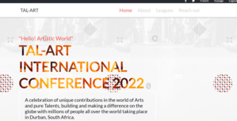

# Capstone Project

> This is my Capstone project for Module 1 at Microverse. This website is about a conference name TAL-ART. TAL-ART conference 2022 is about recognising talents in the art and entertainment industry. I used the guidlines template of an online conference created by Cindy Shin. This is the website created by Cindy Shin https://summit.cckorea.org/introduce.html#

# Project Name
* TAL-ART CONFERENCE 2022

## Image preview

## Built With

- HTML
- CSS
- JAVASCRIPT
- VSCODE

## Live Demo

[Live Demo Link](https://aneallaryea100.github.io/Capstone/)

## Link to the video explanation
* https://www.loom.com/share/d1630c6822c34536ba726a332c36d635

# Prerequisite
* Modern Browser.Example: Firefox, chrome.
* Windows 7 and above, MacOs, linux and android.
# SET UP
* Download the folder and click on index.html

# AUTHOR
👤 Aneal Laryea
* Github: [@aneallaryea](https://github.com/aneallaryea100)
* LinkdIn: [@aneallaryea](https://www.linkedin.com/in/nii-aneal-84ba7a147)
* Twitter: [@twitterhandle](https://twitter.com/twitterhandle)

## 🤝 Contributing

Contributions, issues, and feature requests are welcome!

Feel free to check the [issues page](../../issues/).

## Show your support

Give a ⭐️ if you like this project!

## Acknowledgments

- This project was inspired from the original project of Cindy Shin.
- The link to the project (https://www.behance.net/gallery/29845175/CC-Global-Summit-2015)

## 📝 License

This project is [MIT](./MIT.md) licensed.
